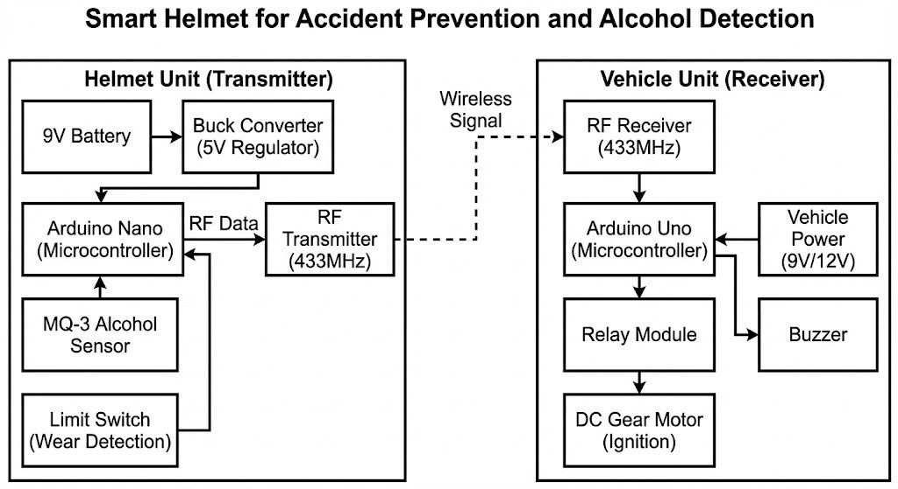
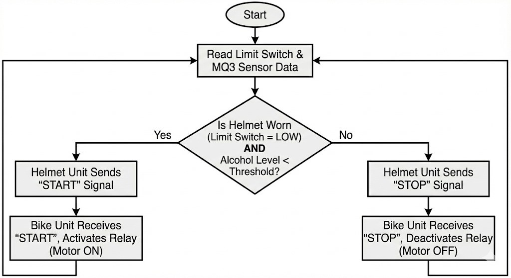

# Intelligent-smart-helmet
IoT based Smart Helmet using Arduino, Alcohol Sensor, and RF communication
## Overview
This project is an IoT-based safety system designed to prevent drunk driving and ensure helmet usage. It uses a Master-Slave architecture with RF communication.

## Features
- **Alcohol Detection:** MQ-3 Sensor stops ignition if alcohol is detected.
- **Wear Detection:** Limit switch ensures the helmet is worn.

## Tech Stack
- **Hardware:** Arduino Uno, Nano, RF 433MHz Modules.
- **Software:** Embedded C, Arduino IDE.

## Setup
1. Upload `helmet_code.ino` to the Transmitter Arduino.
2. Upload `bike_code.ino` to the Receiver Arduino.
3. Connect the relay to the ignition circuit.

## System Architecture 🏗️
Here is the visual representation of how the Smart Helmet system works:

### Block Diagram

### Flowchart

---

## Prototype Gallery 📸
Here is the actual hardware setup showing the Helmet Unit and Bike Unit:

### 🎥 Project Demo
[Click here to watch the working video](workingvideo.mp4)

## 📄 Full Project Documentation
Want to read the detailed report? 
[Click here to view the Project Report PDF](MYMINI PROJECT Report.pdf)

